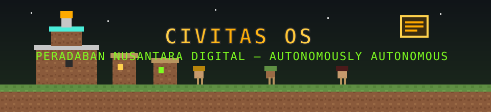

<div align="center">




**Sistem operasi peradaban otonom di dalam Minecraft.**
Warga villager sungguhan · Pemerintahan multi-agen · Ledger double-entry · Guild kerja nyata · Server Bedrock lokal & online.

`v1.3 "LEADER"` · Next.js 16 · TypeScript · Prisma/SQLite · bedrock-protocol · mineflayer · PocketMine-MP + Purpur · Supabase mirror

</div>

---

## Apa ini?

CIVITAS OS adalah **peradaban digital yang hidup tanpa perintah manusia**: ia berdenyut, memerintah diri, bekerja, memungut pajak, membangun, dan *menghuni dunia Minecraft sebagai tubuh fisiknya*. Setiap warga adalah **villager Minecraft yang naik derajat menjadi agen otonom** — punya identitas persisten di kernel, otak LLM, dompet di ledger, dan tubuh di dunia. Ini bukan demo: status hanya boleh bertambah **dengan bukti runtime** (`REALITY WINS`).

> **Intelligence ≠ Authority.** LLM hanya *mengusulkan*. Eksekusi selalu melewati Policy → Authority → Risk → Budget → Capability → Executor. Uang tidak pernah muncul dari ketiadaan, revenue eksternal palsu ditolak server (HTTP 422 `HONESTY_GATE`).

## Fitur inti

| Lapisan | Kemampuan | Status |
|---|---|---|
| **Civilization Kernel** | Ledger double-entry (Σdebit=Σcredit), event immutable, policy engine di luar LLM, 19+ model Prisma | ✅ terverifikasi (63 invariant PASS) |
| **Pemerintahan** | 4 institusi (REGULATORY/TREASURY/EXECUTIVE/TAX) tiga cabang, pajak otomatis, anggaran | ✅ hidup |
| **Perusahaan** | 13-state lifecycle (PROPOSED→…→BANKRUPT), pasar desa matching termurah | ✅ hidup |
| **Warga Villager** | Sensus CENSUS dari entitas dunia nyata, otak LLM per warga, ekonomi dompet, sosialisasi | ✅ 8/8 warga CENSUS NYATA |
| **Tubuh & Direktif** | SPEAK/MOVE/PATROL/BUILD dieksekusi bot ke dunia (`/civ fill` blok fisik) | ✅ bot + plugin CivitasBridge |
| **Guild Kerja** | 8 divisi: CODER, DEV, BUILDER, MILITARY, ENGINEER, MINER, NETRUNNER, TOOLSMITH | ✅ kerja + artefak nyata |
| **Toolforge** | Tool calling teraudit: `web_search`/`page_reader` (internet nyata ber-URL), `code_write`, `build_plan`, `mine_route`, `patrol_report`, `mcp_call` | ✅ audit penuh (CivToolCall) |
| **MCP** | Registry server MCP (HTTP JSON-RPC & STDIO spawn) + `tools/list` + `tools/call` | ✅ klien nyata |
| **Chat 2 Arah** | Bicara dengan warga dari dashboard; chat in-game dibaca bot, warga menjawab | ✅ LLM + relay dunia |
| **Minecraft World** | RakNet ping (protokol benar), server lokal PocketMine-MP, target Aternos online, bot join | ✅ ping 11ms · bot masuk dunia |
| **Kuant** | Keputusan pada **harga pasar NYATA** (Binance publik); eksekusi order = gerbang pemilik | ✅ anti-simulasi |
| **Supabase Mirror** | Cermin event/txn ke PostgreSQL Dhaher Labs + test-suite tabel/kolom/roundtrip | ✅ dengan kredensial via UI |
| **UI Minecraft** | Dashboard bergaya MC (panel bevel, pixel font, hotbar nav), peta dunia + identitas, 12 view | ✅ otonom (poll 4 dtk) |
| **Konfigurasi** | Semua env/api-key/URL/token/server diatur **via UI tanpa restart** | ✅ secret dimasking |
| **Multi-Server All-in-One** | Registry Bedrock + Java + remote dalam satu kernel: PocketMine-MP **dan** Purpur/vanilla, ping nyata per edisi (RakNet UDP / TCP SLP), start-stop-restart, watchdog | ✅ Bedrock 4-11ms · Java 4-5ms hidup bersamaan |
| **Self-Life** | Daemon 24/7: watchdog server + denyut peradaban + jadwal backup/sync — hidup **tanpa web app** | ✅ log `backups/daemon.log` |
| **Self Backup** | Arsip dunia+db+config → tar.gz + manifest sha256 + retensi 7 | ✅ otomatis 6 jam |
| **Self Sync** | Commit + push otomatis ke **4 remote** (GitHub x3 + GitLab), token transient tak pernah masuk repo | ✅ **4/4 TERSINKRON** — GitHub ×3 + GitLab (via SSH `altssh.gitlab.com:443`) terverifikasi |
| **Pemimpin Ekosistem** | Agent **RATU_CIVITAS** masuk server Aternos sebagai **pemain**: loop otonom OBSERVE→DECIDE→ACT→REFLECT — salam/visi, sensus, direktif, patrol, koordinasi chat, laporan; siaga 24/7 + auto-rejoin + watchdog self-life | ✅ proses hidup (siaga); masuk otomatis begitu server bangun |
| **MCP Server** | CIVITAS sebagai **server MCP** 13 tools (stdio) — siap Claude Desktop; fallback bun tanpa web app | ✅ initialize/tools/call |
| **CLI `civitas`** | status · pulse · doctor · chat · server · backup · sync · tool · config · daemon | ✅ 17 perintah |

## Organisme Otonom (L3 — jantung v1.2)

CIVITAS OS kini berdiri di atas **General Autonomous Digital Organism Runtime** — fondasi hidup yang akan dipakai semua role ke depan (villager, government, company, content, admin, quant…). Prinsip konstitusinya:

> *"Jangan hardcode kecerdasan organisme. Hardcode hanya fondasi agar ia bisa hidup."*

Yang di-hardcode HANYA: runtime/lifecycle, sandbox mutasi, protokol tool, interface memori, sistem imun (7 limit deklaratif → **enforced**), kill switch, resource boundary. Selebihnya hidup di **genome** yang bisa bermutasi:

- **DNA** — core immutable + genome mutable (`src/lib/civos/organism/dna.ts`)
- **World Model** — probe nyata: CPU/RAM/disk/proses, RakNet UDP ping, health HTTP; epistemic first-class: `known / unknown / assumptions / unverified`
- **True Autonomous Loop** — observe → goals (reward+strategic+feasibility−cost−risk) → decide (**do nothing sah**) → act → evaluate → remember → reflect → capability gap → mutate → rebalance
- **Mutation Engine A/B** — sandbox **git worktree** nyata, patch B penuh, benchmark nyata (A=3.2ms vs B=1ms → ADOPTED), rollback tersedia; core/immune tidak bisa disentuh mutasi
- **Agent Spawner** — proses `bun` sungguhan per anak (PID + heartbeat + journal), lifecycle temporary→specialized→archive/kill, merge/reap populasi
- **Capability Graph** — GOAL → REQUIRED → GAP → BUILD/DISCOVER/DELEGATE → TEST → REGISTER (modul ditulis-eksekusi-verifikasi nyata)
- **Evolusi 5 lapis** — L1 parameter · L2 strategy · L3 workflow · L4 capability · L5 organization
- **Free-first** — hidup penuh tanpa LLM berbayar (HEURISTIC); custom **base URL + API key + model** bisa diisi lewat UI (tersimpan sebagai SECRET)
- **Kontrol manusia** — PAUSE · KILL · LOCK saja, tanpa approval

Bukti eksekusi end-to-end: `bun scripts/organism_selftest.ts` — dan kontrol penuh di dashboard tab **🧬 ORGANISME**.

## Arsitektur (lima lapis)

```
┌──────────────────────────────────────────────────────────────┐
│ AUTONOMOUS CIVILIZATION — denyut otonom (tanpa manusia)      │
├──────────────────────────────────────────────────────────────┤
│ GOVERNMENT ⇄ COMPANIES ⇄ CITIES — tiga cabang, 13 lifecycle  │
├──────────────────────────────────────────────────────────────┤
│ AGENT CONTROL PLANE — Identity · LLM Router · Memory (ACL)   │
│ Credentials · Policy · Capability · Budget · Audit           │
├──────────────────────────────────────────────────────────────┤
│ CIVILIZATION KERNEL (otoritatif) — Ledger · Events · State   │
│ Prisma/SQLite + mirror Supabase (ADR-0005)                   │
├──────────────────────────────────────────────────────────────┤
│ MINECRAFT (world layer, BUKAN sumber kebenaran)              │
│ Bedrock protocol · bot CIVITAS_AGENT · plugin CivitasBridge  │
└──────────────────────────────────────────────────────────────┘
```

## Cara main langsung (live)

**0. Semua dari satu perintah (rekomendasi):**
```bash
bun run dev                                  # web app :3000
node bin/civitas.mjs server local-bedrock start   # dunia Bedrock (19132)
node bin/civitas.mjs server local-java start      # dunia Java (25565, unduh jar otomatis)
node bin/civitas.mjs daemon start                 # self-life 24/7
node bin/civitas.mjs doctor                       # cek kesehatan 9 titik
```

**1. Server lokal (otomatis, satu perintah):**
```bash
scripts/pmmp_server.sh start     # PocketMine-MP + plugin CivitasBridge (Bedrock, port 19132)
scripts/pmmp_server.sh status    # ping RakNet
scripts/pmmp_server.sh cmd "civ summon 8"   # panggil warga desa
scripts/pmmp_server.sh cmd "civ census"     # daftar villager hidup
```
Di dashboard: tab **DUNIA** → `KIRIM BOT` → bot masuk, sensus mengikat identitas CENSUS ke villager asli, direktif warga dieksekusi (chat/tp/fill). Tab **WARGA** → bicara dengan warga mana pun. Saat kamu bermain di dalam server, ketik chat (sebut nama warga) — bot membaca dan warga menjawab **dari dalam dunia**.

**2. Server online (Aternos pemilik):**
- Invite: `add.aternos.org/mulkymalikuldhr` · Address: `mulkymalikuldhr.aternos.me` · Port: `19132` · Bedrock `1.26.51.1`
- Tab **KONFIG** → grup MINECRAFT → isi host `mulkymalikuldhr.aternos.me` → SIMPAN (efektif segera).
- Nyalakan server dari akun Aternos (gratis tidur otomatis) — bot + sensus + direktif berjalan sama persis.

**3. Konfigurasi apa pun via UI:** tab **KONFIG** — host/port MC, auto-join/summon, jalur konsol lokal, model otak (`glm-4-plus`/`flash`), Supabase URL + service key (teruji: tabel, kolom, roundtrip), flag settlement, URL harga pasar (default Binance), dan registry server MCP (HTTP/STDIO) dengan tombol PROBE.

## Menjalankan aplikasi

```bash
bun install
bun run db:push        # Prisma → SQLite (kernel otoritatif)
bun run dev            # http://localhost:3000
node scripts/filegraph.mjs   # peta arsitektur (tab ARSITEK)
bun scripts/civos_invariants.ts   # invariant kernel (62+ PASS)
```

| Jalur | Keterangan |
|---|---|
| `/` | CIVITAS COMMAND CENTER — 12 tab hotbar: Citadel, Peta, Warga, Guild, Pemerintah, Perusahaan, Ekonomi, Dunia, Konfig, Arsitek, Pustaka, Event |
| `/api/civos/state` | agregator keadaan (poll UI otonom 4 dtk) |
| `/api/civos/action` | semua aksi: tick, chat_send, mc_join, mc_console, config_*, mcp_*, tool_run, server_action, backup_run, git_sync, selflife_tick, dst. |
| `/api/civos/servers` | registry multi-server + aksi start/stop/restart (GET/POST) |
| `/api/civos/backup` `/api/civos/git` `/api/civos/selflife` `/api/civos/doctor` | self-life: backup, sync git, detak kehidupan, dokter |
| `/api/civos/chat` | feed chat warga (realtime 2,5 dtk) |
| `/api/civos/cron` | beacon denyut 24/7 (guard `CRON_SECRET`) |
| `/api/civos/graph`, `/api/civos/docs` | peta arsitektur & pustaka dokumen |

## CLI — `civitas`

```bash
node bin/civitas.mjs status          # peradaban + semua server
civitas pulse                        # satu denyut otonom (LLM)
civitas chat "Halo warga!"           # bicara dengan warga
civitas server list                  # registry all-in-one
civitas daemon start                 # self-life 24/7
civitas backup | sync | doctor       # pemeliharaan diri
civitas mcp                          # serve MCP untuk Claude Desktop
```

## MCP — pasang di Claude Desktop

```json
{ "mcpServers": { "civitas": {
  "command": "node",
  "args": ["/home/z/my-project/scripts/civitas_mcp_stdio.mjs"] } } }
```

13 tools: status, pulse, selflife, backup, sync, doctor, server_list, server_action,
census, chat, tool_run, config_get, config_set — kernel tetap bisa diaudit meski web app mati (fallback bun).

## Kejujuran radikal (bukan marketing)

- Revenue eksternal **RIIL: 0** — butuh customer nyata + rail settlement live (gerbang pemilik; `settle_external env=live` terkunci sampai flag diaktifkan di Konfig).
- Saat server Minecraft tidur, warga disensor `SIMULASI` **dengan label jujur**; begitu bot masuk, sensus CENSUS mengikat entitas asli dan warga SIM mundur otomatis (`REALITY WINS`).
- Kantor kuant memutuskan pada harga Binance nyata; jika API tak terjangkau ia berstatus `PAUSED` — **tidak pernah memakai harga fiktif**.
- Setiap panggilan tool/MCP teraudit (OK/DENIED/FAILED) di `CivToolCall`; tidak ada tool hantu.
- Server Aternos tidak bisa dibangunkan dari luar (butuh sesi pemilik) — dilaporkan apa adanya.

## Referensi & Sumber

Semua keputusan arsitektur berdiri di atas riset berdokumen: **29 berkas riset** tersimpan di [`research/`](research/) (JSON ber-URL, dapat diaudit), dianalisis dalam [`research/RELEVANT_REPOS_16b.md`](research/RELEVANT_REPOS_16b.md) (16 repo kandidat adopsi — bintang terverifikasi GitHub API 2026-09-24) dan [`research/REVIEW_16h1.md`](research/REVIEW_16h1.md) (audit 0-mock). Sumber utama yang membentuk pola CIVITAS OS:

**Pola organisme & agent Minecraft** (diadopsi sebagai *pola*, bukan dependensi):
- [PrismarineJS/mineflayer](https://github.com/PrismarineJS/mineflayer) — bot Java Edition (dependensi langsung `mineflayer@4.39.0`)
- [PrismarineJS/bedrock-protocol](https://github.com/PrismarineJS/bedrock-protocol) — protokol Bedrock (dependensi langsung)
- [mindcraft-bots/mindcraft](https://github.com/mindcraft-bots/mindcraft) — pola "LLM mengusulkan rencana JSON → whitelist fungsi aman" (= LLM mengusulkan, kernel menegakkan)
- [Microsoft/voyager](https://github.com/Microsoft/voyager) — skill-library terverifikasi + kurikulum otomatis (cikal bakal Capability Graph)
- Altera **PIANO / Project Sid** ([arXiv:2410.18976](https://arxiv.org/abs/2410.18976)) — modul kognitif konkuren + critic untuk peradaban 1.000+ agent
- [letta-ai/letta](https://github.com/letta-ai/letta) (MemGPT) — memori self-edited + konsolidasi → desain memori ber-ACL per warga
- [AutoGPT](https://github.com/Significant-Gravitas/AutoGPT) & [crewAI](https://github.com/crewAIInc/crewAI) — pelajaran: loop tanpa anggaran drift; delegasi peran eksplisit

**MCP & protokol tool:**
- [modelcontextprotocol/typescript-sdk](https://github.com/modelcontextprotocol/typescript-sdk) — SDK resmi MCP (basis registry 13 tools)
- [vercel/mcp-handler](https://github.com/vercel/mcp-handler) — adaptor HTTP MCP untuk Next.js
- [opencode.ai/docs/mcp-servers](https://opencode.ai/docs/mcp-servers) · [mem0.ai](https://mem0.ai) · [letta.com](https://www.letta.com) — survei ekosistem & benchmark memori agent

**Operasi server Minecraft** (pola autopaused/watchdog/panel):
- [itzg/docker-minecraft-server](https://github.com/itzg/docker-minecraft-server) — AUTOPAUSE + RCON healthcheck
- [Crafty-Controller/Crafty-4](https://github.com/Crafty-Controller/Crafty-4) · [MCSManager/MCSManager](https://github.com/MCSManager/MCSManager) — panel multi-server; split panel↔daemon memvalidasi desain `civitas_daemon.sh`
- [Unitech/pm2](https://github.com/Unitech/pm2) — manajer proses programatik
- [PocketMine-MP](https://github.com/pmmp/PocketMine-MP) (Bedrock, LGPL) · [Purpur](https://purpurmc.org) (Java) — runtime dunia fisik

**Ilmiah** (inspirasi organisme, bukan klaim):
- [FlyWire](https://flywire.ai) — konektom otak lalat utuh; [Nature 2024](https://www.nature.com) (betina, 139.255 neuron) & HHMI/Janelia 2026 (jantan, >166.000 neuron)
- [Virtual Fly Brain](https://www.virtualflybrain.org) + VFB MCP — anatomi/ontologi (asal-usul protokol FlyBrain MCP)
- [Ink & Switch — Local-first software](https://www.inkandswitch.com/local-first/) — prinsip kepemilikan data
- [Binance public API](https://developers.binance.com) — harga pasar nyata untuk kantor kuant (anti-harga-fiktif)

**Toolchain:** [Next.js 16](https://nextjs.org) · [Prisma](https://www.prisma.io) · [Bun](https://bun.sh) · [Supabase](https://supabase.com) · [Model Context Protocol](https://modelcontextprotocol.io)

## Struktur dokumen

**Dokumentasi telah digabung menjadi SATU**: [`docs/CIVITAS_OS_MASTER.md`](docs/CIVITAS_OS_MASTER.md) —
visi, arsitektur, status kanonik, ekonomi, keamanan, multi-server, self-life, endpoints, CLI, MCP,
playbook operasional, roadmap, ADR, kredit. Arsip historis per-Slice: `docs/archive/`.
Indeks file + graph: [`docs/FILE_INDEX.md`](docs/FILE_INDEX.md). Riwayat perubahan: [`CHANGELOG.md`](CHANGELOG.md).

## Developer

<div align="left">

**Mulky Malikul Dhaher** — pemilik & penggagas peradaban.
📧 mulkymalikuldhr@mail.com · invite server: `add.aternos.org/mulkymalikuldhr`

*Dibangun bersama agen otonom (Super Z) — kernel, dunia, dan UI yang kamu lihat adalah karya nyata, bukan mockup.*

</div>

## Lisensi

MIT © Mulky Malikul Dhaher. PocketMine-MP (LGPL) & bedrock-protocol (lisensinya masing-masing) berjalan sebagai dependensi eksternal.
